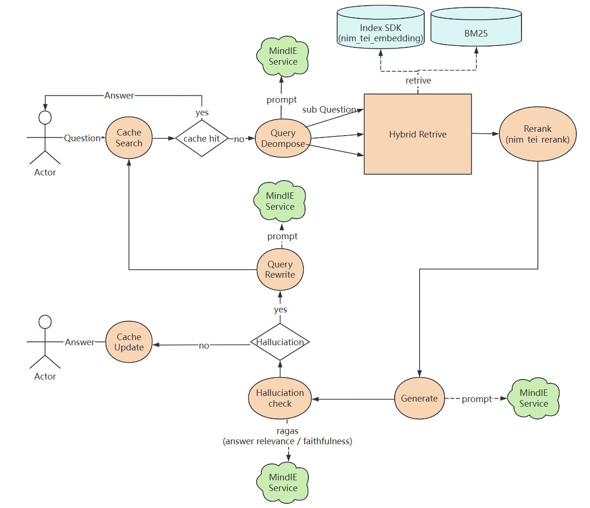

# RAG SDK基于LangGraph知识检索增强应用使能方案

## 1 背景

### 1.0 LangGraph介绍

[LangGraph官方介绍](https://blog.langchain.dev/langgraph/)
> LangGraph是Langchain新出的一个成员，是 LangChain 的 LangChain Expression Language
> （LCEL）的扩展。能够利用有向无环图的方式，去协调多个LLM或者状态，使用起来比 LCEL
> 会复杂，但是逻辑会更清晰。前期大家都学习了langchain,现在再上手学习langGraph就会容易许多，这也是我上面提到过的学习成本。我们可以把它也当做langchain扩展出来的Agent框架，langchain原有agent
> 的实现在LangGraph中都得到了重新实现，所以对于原来使用Langchain的系统去接入更容易。

### 1.1 RAG SDK介绍

RAG SDK 详细资料参考 [《RAG SDK 用户指南》](https://www.hiascend.com/document/detail/zh/mindsdk/730/rag/ragug/mxragug_0001.html)
> RAG SDK 是昇腾面向大语言模型的知识增强开发套件，为解决大模型知识更新缓慢以及垂直领域知识问答弱的问题，面向大模型知识库提供垂域调优、生成增强、知识管理等特性。

### 1.2 昇腾mis介绍

> mis: mind inference microservice
>
昇腾提供基于昇腾硬件加速的reranker和embedding mis服务，通过快速部署就可以支撑RAG应用。
<div align="center">

</div>

embedding tei  [安装地址](https://www.hiascend.com/developer/ascendhub/detail/07a016975cc341f3a5ae131f2b52399d)
reranker tei [安装地址](https://www.hiascend.com/developer/ascendhub/detail/07a016975cc341f3a5ae131f2b52399d)

## 2 环境安装

参考[ RAG SDK 用户指南](https://www.hiascend.com/document/detail/zh/mindsdk/730/rag/ragug/mxragug_0001.html)"安装部署"章节，分别安装cann、rag SDK、以及部署embedding, reranker, mindie Service服务,安装langgraph包:pip3
install langgraph==0.2.19

## 3 总体介绍

基于langgraph和rag sdk搭建RAG应用, 根据langgraph的定义需要包含node和graph，node中使用rag sdk完成相应的功能。

**RAG 节点(Node)定义**

* cache search node:用户问题缓存查询节点
* query decompose node:用户问题拆分子问题节点
* hybrid Retrieve node:用户问题混合检索文档节点
* rerank node:重排检索文档节点
* generate node:大模型生成节点
* halluciation check node:生成内容幻觉检查节点
* query rewrite node: 用户问题重写节点
* cache update node: 用户问题缓存更新节点

**RAG 图(GRAPH)定义**
图定义如下:


状态转换如下表所示:
name | type |next hop | input | output
-|-|-|-|-
**cache search**| node| if cache hit return generation to user else go **query decompose** | (qustion) | if hit (
question, generation) else (qustion)
**query decompose** | node | **hybrid retrieve** | (question) | (question, sub_qustion)
**hybrid retrieve** | node | **rerank** | (question, sub_qustion) | (question, sub_qustion, contexts)
**rerank** | node | **generate** | (question, sub_qustion, contexts) | (question, sub_qustion, contexts)
**query rewrite** | node | **cache search** | (question, sub_qustion, contexts) or (question, sub_qustion, contexts,
generate) | (question)
**generate**| node | **halluciation check** | (question, sub_qustion, contexts) | (question, sub_qustion, contexts,
generate)
**halluciation check** | node | if halluciation check pass go **cache update** else go **query rewrite** | (question,
sub_qustion, contexts, generate) | (question, sub_qustion, contexts, generate)
**cache update** | node | END | (question, sub_qustion, contexts, generate) | (question, sub_qustion, contexts,
generate)

## 4 RAG SDK 功能初始化

完整的代码样例请参考[langgraph_demo.py](langgraph_demo.py)

### 4.1 RAG文档加载和切分

以下是初始化一个docx的文件加载器和文件切分器，并且按照chunk_size=200,chunk_overlap=50进行切分，详细的API文档请参考RAG
SDK的使用手册。

```python
def create_loader_and_spliter(mxrag_component: Dict[str, Any],
                              chunk_size:int = 200,
                              chunk_overlap:int = 50):
    from langchain.text_splitter import RecursiveCharacterTextSplitter

    from mx_rag.knowledge.doc_loader_mng import LoaderMng
    from mx_rag.document.loader import DocxLoader

    loader_mng = LoaderMng()
    loader_mng.register_loader(DocxLoader, [".docx"])
    loader_mng.register_splitter(RecursiveCharacterTextSplitter, [".docx"],
                                 {"chunk_size": chunk_size, "chunk_overlap": chunk_overlap, "keep_separator": False})
    mxrag_component["loader_mng"] = loader_mng
```

### 4.2 RAG远端服务

以下是分别初始化mindie Service，AIM embedding，AIM reranker服务，用户需要传入相应的地址。

```python
def create_remote_connector(mxrag_component: Dict[str, Any],
                            reranker_url: str,
                            embedding_url: str,
                            llm_url: str,
                            llm_model_name: str):
    from mx_rag.llm.text2text import Text2TextLLM
    from mx_rag.embedding import EmbeddingFactory
    from mx_rag.reranker.reranker_factory import RerankerFactory

    reranker = RerankerFactory.create_reranker(similarity_type="tei_reranker",
                                               url=reranker_url,
                                               client_param=ClientParam,(use_http=True),
                                               k=3)
    mxrag_component['reranker_connector'] = reranker

    embedding = EmbeddingFactory.create_embedding(embedding_type="tei_embedding",
                                                  url=embedding_url,
                                                  client_param=ClientParam(use_http=True))
    mxrag_component['embedding_connector'] = embedding

    llm = Text2TextLLM(base_url=llm_url, model_name=llm_model_name,
                       client_param=ClientParam(use_http=True),
                       llm_config=LLMParameterConfig(max_tokens=4096))
    mxrag_component['llm_connector'] = llm
```

### 4.3 RAG知识库

以下是存放用户知识文档的样例，这里使用mxindex(MindFaiss)作为矢量检索，knowledge_files是用户需要传入包含文件路径的文件名列表。

```python
def create_knowledge_storage(mxrag_component: Dict[str, Any], knowledge_files: List[str]):
    from mx_rag.knowledge.knowledge import KnowledgeStore
    from mx_rag.knowledge import KnowledgeDB
    from mx_rag.knowledge.handler import upload_files
    from mx_rag.storage.document_store import SQLiteDocstore

    npu_dev_id = 0
    
    # faiss_index_save_file is your faiss index save dir
    faiss_index_save_file:str = "/home/HwHiAiUser/rag_npu_faiss.index"
    vector_store = MindFAISS(x_dim=1024,
                             devs=[npu_dev_id],
                             load_local_index=faiss_index_save_file)
    mxrag_component["vector_store"] = vector_store


    # sqlite_save_file is your sqlite save dir
    sqlite_save_file:str = "/home/HwHiAiUser/rag_sql.db"
    chunk_store = SQLiteDocstore(db_path=sqlite_save_file)
    mxrag_component["chunk_store"] = chunk_store

    # your knowledge file white paths if docx not in white paths will raise exception
    white_paths=["/home/HwHiAiUser/"]
    knowledge_store = KnowledgeStore(db_path=sqlite_save_file)
    knowledge_store.add_knowledge("rag", "Default01", "admin")
    Knowledge_db = KnowledgeDB(knowledge_store=knowledge_store, chunk_store=chunk_store, vector_store=vector_store,
                               knowledge_name="rag", white_paths=white_paths, user_id="Default01")
    
    upload_files(Knowledge_db, knowledge_files, loader_mng=mxrag_component.get("loader_mng"),
                 embed_func=mxrag_component.get("embedding_connector").embed_documents,
                 force=True)
```

### 4.4 RAG缓存系统

定义语义缓存系统，用于缓存用户已经提供过的答案，当用户再次提问相似的问题可以很快
返回结果，不需要再进行大模型推理，加速E2E性能。
语义缓存一般包含矢量数据库，标量数据库以及相应的embedding和相似度计算方法。

```python
def create_cache(mxrag_component: Dict[str, Any],
                 reranker_url: str,
                 embedding_url: str):
    from mx_rag.cache import SimilarityCacheConfig
    from mx_rag.cache import EvictPolicy
    from mx_rag.cache import MxRAGCache

    npu_dev_id = 0
    # data_save_folder is your cache file when you next run your rag applicate it will read form disk
    cache_data_save_folder = "/home/HwHiAiUser/mx_rag/cache_save_folder/"

    similarity_config = SimilarityCacheConfig(
        vector_config={
            "vector_type": "npu_faiss_db",
            "x_dim": 1024,
            "devs": [npu_dev_id],
        },
        cache_config="sqlite",
        emb_config={
            "embedding_type": "tei_embedding",
            "url": embedding_url,
            "client_param": ClientParam(use_http=True)
        },
        similarity_config={
            "similarity_type": "tei_reranker",
            "url": reranker_url,
            "client_param": ClientParam(use_http=True)
        },
        retrieval_top_k=3,
        cache_size=100,
        auto_flush=100,
        similarity_threshold=0.70,
        data_save_folder=cache_data_save_folder,
        disable_report=True,
        eviction_policy=EvictPolicy.LRU
    )

    similarity_cache = MxRAGCache("similarity_cache", similarity_config)
    mxrag_component["cache"] = similarity_cache
```

### 4.5 RAG评估系统

以下是初始化评估系统，这里使用大模型进行评估

```python
def create_evaluate(mxrag_component):
    from mx_rag.evaluate import Evaluate

    llm = mxrag_component.get("llm_connector")
    embedding = mxrag_component.get("embedding_connector")
    mxrag_component["evaluator"] = Evaluate(llm=llm, embedding=embedding)
```

### 4.6 RAG混合检索

以下是构建混合检索的样例，这里使用了矢量检索和BM25检索，并按照RRF算法设置权重进行排序得到最后的检索文档。

```python
def create_hybrid_search_retriever(mxrag_component: Dict[str, Any]):
    from langchain.retrievers import EnsembleRetriever

    from mx_rag.retrievers.retriever import Retriever
    from mx_rag.retrievers import BMRetriever

    chunk_store = mxrag_component.get("chunk_store")
    vector_store = mxrag_component.get("vector_store")
    embedding = mxrag_component.get("embedding_connector")

    npu_faiss_retriever = Retriever(vector_store=vector_store, document_store=chunk_store,
                                    embed_func=embedding.embed_documents, k=10, score_threshold=0.4)

    hybrid_retriever = EnsembleRetriever(
        retrievers=[npu_faiss_retriever], weights=[1.0]
    )

    mxrag_component["retriever"] = hybrid_retriever
```

## 5 langgraph 图定义和编译运行

完整的代码样例请参考[langgraph_demo.py](langgraph_demo.py)

### 5.1 Node定义

#### 5.1.1 Cache Search

使用用户的问题，访问rag cache，如果命中generation不为None

```python
def cache_search(cache):
    def cache_search_process(state):
        logger.info("---QUERY SEARCH ---")
        question = state["question"]
        generation = cache.search(question)
        return {"question": question, "generation": generation}
    
    return cache_search_process
```

判决cache search 是否hit，根据generation 是否为None进行判断，如果为None则表示
cache miss，如果不为None则cache hit

```python
def decide_to_decompose(state):
    logger.info("---DECIDE TO DECOMPOSE---")
    cache_generation = state["generation"]

    if cache_generation is None:
        logger.warning(
            "---DECISION: CACHE MISS GO DECOMPOSE---"
        )
        return "cache_miss"
    
    logger.info("---DECISION: CACHE HIT END---")
    return "cache_hit"
```

#### 5.1.2 Query Decompose

使用提示词工程进行问题拆解，拆解为子问题

```python
def decompose(llm):
    sub_question_key_words = "Q:"
    prompt = PromptTemplate(
        template="""
                    请你参考如下示例，拆分用户的问题为独立子问题，如果无法拆分则返回原始问题:
                    示例一:
                    用户问题: 今天的天气如何, 你今天过的怎么样?

                    {sub_question_key_words}今天的天气如何?
                    {sub_question_key_words}你今天过的怎么样?

                    示例二:
                    用户问题: 汉堡好吃吗?

                    {sub_question_key_words}汉堡好吃吗?

                    现在请你参考示例拆分以下用户问题:
                    用户的问题:{question}
                    """,
        input_variables=["question", "sub_question_key_words"]
    )

    sub_question_generator = LLMChain(llm=llm, prompt=prompt)

    def decompose_process(state):
        logger.info("---QUERY DECOMPOSITION ---")
        question = state["question"]

        sub_queries = sub_question_generator.predict(question=question, sub_question_key_words=sub_question_key_words)
        if sub_question_key_words not in sub_queries:
            sub_queries = None
        else:
            sub_queries = sub_queries.split(sub_question_key_words)
            sub_queries = sub_queries[1:]

        return {"sub_questions": sub_queries, "question": question}
    
    return decompose_process
```

#### 5.1.3 Hybrid Retrive

以下是进行混合检索，如果sub_question为None则使用quesiton进行检索，如果sub_question不为None则使用sub_question进行检索。

```python
def retrieve(retriever: BaseRetriever):
    def retrieve_process(state):
        logger.info("---RETRIEVE---")
        sub_questions = state["sub_questions"]
        question = state["question"]

        documents = []
        docs = []
        if sub_questions is None:
            docs = retriever.get_relevant_documents(question)
        else:
            for query in sub_questions:
                docs.extend(retriever.get_relevant_documents(query))
        
        for doc in docs:
            if doc.page_content not in documents:
                documents.append(doc.page_content)
        
        return {"documents": documents, "question": question}
    
    return retrieve_process
```

#### 5.1.4 Rerank

将用户的检索文档根据语义进行重排序

```python
def rerank(reranker):
    def rerank_process(state):
        logger.info("---RERANK---")
        question = state["question"]
        documents = state["documents"]

        scores = reranker.rerank(query=question, texts=documents)
        documents = reranker.rerank_top_k(objs=documents, scores=scores)

        return {"documents": documents, "question": question}

    return rerank_process
```

#### 5.1.6 Generate

使用提示词工程访问进行大模型推理过程得到生成结果。

```python
def generate(llm):
    prompt = PromptTemplate(
        template="""{context}
                 
                 根据上述已知信息,简洁和专业的来回答用户问题。如果无法从中已知信息中得到答案，请根据自身经验做出回答

                 {question}
                 """,
        input_variables=["context", "question"]
    )

    rag_chain = LLMChain(llm=llm, prompt=prompt)

    def generate_process(state):
        logger.info("---GENERATE---")
        question = state["question"]
        documents = state["documents"]

        generation = rag_chain.predict(context=documents, question=question)
        return {"documents": documents, "question": question, "generation": generation}
    
    return generate_process
```

#### 5.1.7 Halluciation Check

利用大模型评估进行判断生成质量是否符合用户需求。

```python
def grade_generation_v_documents_and_question(evaluate,
                                              context_score_threshold: float = 0.6,
                                              answer_score_threshold: float = 0.6):
    generate_evalutor = evaluate_creator(evaluate, "generate_relevancy")

    def grade_generation_v_documents_and_question_process(state):
        logger.info("---CHECK HALLUCINATIONS---")

        answer_score, context_score = generate_evalutor(state)

        answer_score = answer_score[0]
        logger.info("---GRADE GENERATION vs QUESTION---")
        if answer_score < answer_score_threshold:
            logger.warning(f"---DECISION: GENERATION DOES NOT ADDRESS QUESTION,"
                           f" RE-TRY--- answer_score:{answer_score},"
                           f"answer_score_threshold:{answer_score_threshold}")
            return "not useful"
        
        logger.info(f"---DECISION: GENERATION ADDRESSES QUESTION--- "
                    f"answer_score:{answer_score},"
                    f"answer_score_threshold:{answer_score_threshold}")
        
        context_score = context_score[0]
        logger.info("---GRADE GENERATION vs DOCUMENTS---")
        if context_score < context_score_threshold:
            logger.warning(f"---DECISION: GENERATION IS NOT GROUNDED IN DOCUMENTS, "
                           f" RE-TRY--- context_score:{context_score},"
                           f"context_score_threshold:{context_score_threshold}")
            return "not useful"
        
        logger.info(f"---DECISION: GENERATION GROUNDED IN DOCUMENTS---"
                    f"context_score:{context_score},"
                    f"context_score_threshold:{context_score_threshold}")
        return "useful"
    
    return grade_generation_v_documents_and_question_process
```

#### 5.1.8 CacheUpdate

如果大模型生成质量符合要求，则更新缓存

```python
def cache_update(cache):
    def cache_update_process(state):
        logger.info("---QUERY UPDATE ---")
        question = state["question"]
        generation = state["generation"]

        cache.update(question, generation)

        return state
    
    return cache_update_process
```

#### 5.1.9 Query Rewrite

利用提示词工程进行问答重写

```python
def transform_query(llm):
    prompt = PromptTemplate(
        template="""
                 你是一个用户问题重写员, 请仔细理解用户问题的内容和语义和检索的文档，在不修改用户问题
                 语义的前提下，将用户问题重写为可以更好被矢量检索的形式

                 用户问题:{question}
                 """,
        input_variables=["question"]
    )

    question_rewriter = LLMChain(llm=llm, prompt=prompt)

    def transform_query_process(state):
        logger.info("---TRANSFORM QUERY---")
        question = state["question"]
        documents = state["documents"]

        better_question = question_rewriter.predict(question=question)

        return {"documents": documents, "question": better_question}
    
    return transform_query_process
```

### 5.2 图编译

```python
def build_mxrag_application(mxrag_component):
    from langgraph.graph import END, START, StateGraph

    class GraphState(TypedDict):
        question: str
        sub_questions: List[str]
        generation: str
        documents: List[str]

    llm = mxrag_component.get("llm_connector")
    retriever = mxrag_component.get("retriever")
    reranker = mxrag_component.get("reranker_connector")
    cache = mxrag_component.get("cache")
    evaluate = mxrag_component.get("evaluator")

    workflow = StateGraph(GraphState)
    workflow.add_node("cache_search", cache_search(cache))
    workflow.add_node("cache_update", cache_update(cache))
    workflow.add_node("decompose", decompose(llm))
    workflow.add_node("retrieve", retrieve(retriever))
    workflow.add_node("rerank", rerank(reranker))
    workflow.add_node("generate", generate(llm))
    workflow.add_node("transform_query", transform_query(llm))

    workflow.add_edge(START, "cache_search")

    workflow.add_conditional_edges(
        "cache_search",
        decide_to_decompose,
        {
            "cache_hit": END,
            "cache_miss": "decompose",
        },
    )

    workflow.add_edge("decompose", "retrieve")
    workflow.add_edge("retrieve", "rerank")
    workflow.add_edge("rerank", "generate")
    workflow.add_edge("transform_query", "cache_search")
    workflow.add_conditional_edges(
        "generate",
        grade_generation_v_documents_and_question(evaluate),
        {
            "useful": "cache_update",
            "not useful": "transform_query"
        },
    )

    workflow.add_edge("cache_update", END)  
    app = workflow.compile()
    return app
```

### 5.3 在线问答

```python
if __name__ == "__main__":
    mxrag_component: Dict[str, Any] = {}

    # mis tei rerank
    mis_tei_reranker_url = "http://127.0.0.1:port/rerank"
    # mis tei embed
    mis_tei_embedding_url = "http://127.0.0.1:port/embed"

    # mindie llm server
    llm_url = "http://127.0.0.1:port/v1/chat/completions"

    # llm model name like Llama3-8B-Chinese-Chat etc
    llm_model_name = "Llama3-8B-Chinese-Chat"

    # your knowledge list
    knowledge_files = ["/home/HwHiAiUser/doc1.docx"]

    create_loader_and_spliter(mxrag_component, chunk_size=200, chunk_overlap=50)

    create_remote_connector(mxrag_component,
                            reranker_url=mis_tei_reranker_url,
                            embedding_url=mis_tei_embedding_url,
                            llm_url=llm_url,
                            llm_model_name=llm_model_name)

    create_knowledge_storage(mxrag_component, knowledge_files=knowledge_files)

    create_cache(mxrag_component,
                 reranker_url=mis_tei_reranker_url,
                 embedding_url=mis_tei_embedding_url)

    create_hybrid_search_retriever(mxrag_component)

    create_evaluate(mxrag_component)

    rag_app = build_mxrag_application(mxrag_component)

    user_question = "your question"

    start_time = time.time()
    user_answer = rag_app.invoke({"question": user_question})
    end_time = time.time()

    print(f"user_question:{user_question}")
    print(f"user_answer:{user_answer}")
    print(f"app time cost:{(end_time - start_time) * 1000} ms")
```

## 6 附录
